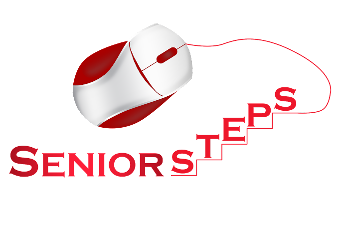
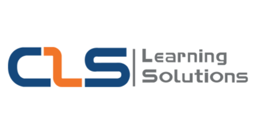
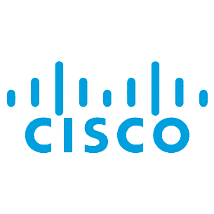
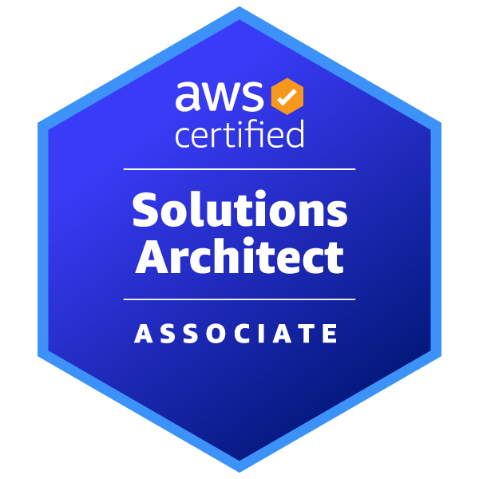

<b>
  Welcome to Mohamed Alaa's Projects' Portfolio!
</b>

# Summary:

  

I'm an enthusiastic and passionate Network and Systems Administrator with extensive knowledge in AWS Cloud Computing. I have a strong academic background in communications, electronics, and computer engineering.

I have always found myself as the person who solves the technical issues facing my family and friends when they're dealing with computers and networks ever since I was a child , so naturally, I decided to pursue a career at something that I believe I'm a natural at.

# Experience:
## alx_africa
### AWS Cloud Computing Program (May 2023 - Feb 2024) (4 Months Soft Skills & 6 Months Program)

  &nbsp&nbsp&nbsp

- Worked on improving soft skills via attending alx hubs and interacting with fellow peers to complete weekly milestones.
- Completed the AWS Academy Cloud Foundations course provided by AWS and alx and learnt about Billing, Security, Network, Compute, Storage ,and Database service categories, AWS CAF, and AWS WellArchitected Framework.
- Applied knowledge learnt in the AWS Academy Cloud Foundations course in lab environments provided during training.
- Currently studying the AWS Academy Cloud Architecting course provided by AWS and alx.

## Senior Steps - IT Training Center
### Red Hat Linux System Administraion Training (June 2023 - August 2024) (3 Months)

  &nbsp&nbsp&nbsp

- Acquired and applied concepts of Linux System Administration as:
  - OS installation, the filesystem hierarchy, and management of files, directories, users, and groups.
  - Management of permissions and privileges, SELinux, and Firewall settings.
  - Management and installation of packages and software.
  - Process and service management and control.
  - Network configuration and secure remote access via SSH.
  - Archiving and compression, and managing storage.
  - Controlling the boot process and troubleshooting failures.
  - Scripting using bash, scheduling, and tuning system performance.
  - Automation using Ansible
 
### Microsoft Windows Server Administration Training (June 2022 - September 2024) (4 Months)

  &nbsp&nbsp&nbsp

- Gained an understanding of Virtualization and applied on it by deploying instances on VMware and VirtualBox.
- Acquired and applied concepts of Windows Server Administration as:
  - OS and drivers installation and initial set up.
  - Remote access via RDP.
  - Installation and management of Active Directory and adding Clients to the domain.
  - Creation and management of Users, Groups, and Organizational Units manually and dynamically.
  - Management of Home Folders, Drive Mappings, Quotas, and Shared Folders.
  - Separation of administrative tasks by deploying different types of administrators and assigning control separately.
  - Controlling access and deploying policies via Group Policy Objects.
  - Storage systems (DAS, SAN, NAS), types (File, Block, Object), RAID, partitioning, and drive configuration (Basic & Dynamic).
  - Management of backup and recovery.
  - Configuring network settings.
  - Setting up DHCP, DNS, NFS, and WDS.
 
## CLS Learning Solutions
### CCNA & CCNA Security Training (July 2021 - September 2021) (3 Months)

  &nbsp&nbsp&nbsp

- Studied the different types of networks, topologies, media, connectors, architectures, devices, access methods, and transmission methods.
- Gained an understanding of the OSI and TCP/IP models and grasped the function of each layer.
- Learnt about the operation of different types of protocols (such as HTTP, TCP, UDP, NAT, PAT, ICMP, the list goes on...) and how to use Subnetting and Supernetting to achieve CIDR.
- Studied network configuration parameters and applied Static and Dynamic (via DHCP) network configuration and network device password recovery.
- Studied and applied dynamic routing protocols as OSPF & IS-IS, RIPv1 & RIPv2, IGRP & EIGRP, and BGP.
- Studied and applied switching concepts as VLANs, Inter-VLAN routing, STP, RSTP, & PVST, and EtherChannel.
- Studied concepts related to Cybersecurity such as the types of attacks, types of security devices, and security policy.

# Certifications:

AWS Solutions Architect Associate

   
  <a href="(https://www.credly.com/badges/a9ff5575-33a2-43a9-8174-b30d69d480a8/public_url)">Verify</a>

# Education:

## Higher Technological Institute of Engineering - 10th of Ramadan City

  

<b>Bachelor's degree with honors in Electronics and Communications Engineering

**Cumulative GPA:** 3.76

**Graduation Project:** Excellent

# Projects:

## SD-WAN Device Initial Configuration Generator:

  

### Project Description:
The SD-WAN Device Initial Configuration Generator is a Python application that creates a text file which contains the initial configuration required for a Cisco SD-WAN device to be able to on-board to the SD-WAN network.

The application works by taking in multiple required and optional arguments from the user which it then uses to create an altered version of one of the input text files (depending on the device type argument specified). The altered version is saved as “output.txt” and rewritten every time the code is executed.

For more, click [here](https://xmoalaa7.github.io/SD-WAN-Initial-Configuration-Generator/).

## SD-WAN Prototype Network:

  

### Project Description:
A prototype infrastructure consisting of two sites (Data Center and Service) that are connected over the actual Internet via Cisco’s SD-WAN Architecture.
The infrastructure incorporates Cisco’s Three Layer Hierarchical Model over its private network on both sites and the Datacenter site includes a Windows Server that provides Services and Administration. Each site includes a FortiGate Firewall and has its WAN Edge Router equipped with an IPS.

For more, click [here](https://xmoalaa7.github.io/SD-WAN-Prototype-Network/).
