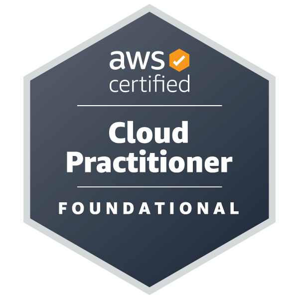
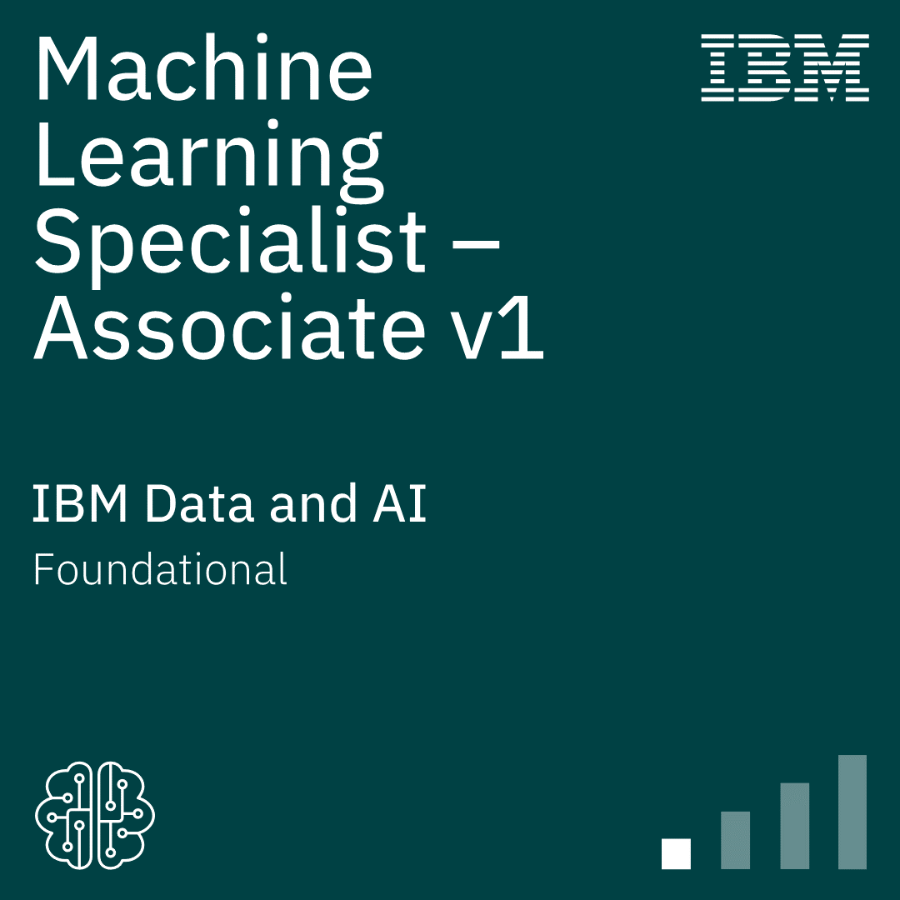

<b>
  Welcome to Mohamed Alaa's Projects' Portfolio!
</b>

# Summary:

  

I'm an enthusiastic and passionate Network and Systems Administrator with extensive knowledge in AWS Cloud Computing. I have a strong academic background in communications, electronics, and computer engineering.

I have always found myself as the person who solves the technical issues facing my family and friends when they're dealing with computers and networks ever since I was a child , so naturally, I decided to pursue a career at something that I believe I'm a natural at.

# Experiences:

   
   
  To view Experiences, click <a href="https://xmoalaa7.github.io/Experiences/">here</a>.

# Certifications:

   
   
  To view Certifications, click <a href="https://xmoalaa7.github.io/Certificationss/">here</a>.

# Education:

## Higher Technological Institute of Engineering - 10th of Ramadan City

  

  Bachelor's degree with honors in Electronics and Communications Engineering

**Cumulative GPA:** 3.76

**Graduation Project:** Excellent

# Projects:

## SD-WAN Device Initial Configuration Generator:

  

### Project Description:
The SD-WAN Device Initial Configuration Generator is a Python application that creates a text file which contains the initial configuration required for a Cisco SD-WAN device to be able to on-board to the SD-WAN network.

The application works by taking in multiple required and optional arguments from the user which it then uses to create an altered version of one of the input text files (depending on the device type argument specified). The altered version is saved as “output.txt” and rewritten every time the code is executed.

For more, click [here](https://xmoalaa7.github.io/SD-WAN-Initial-Configuration-Generator/).

## SD-WAN Prototype Network:

  

### Project Description:
A prototype infrastructure consisting of two sites (Data Center and Service) that are connected over the actual Internet via Cisco’s SD-WAN Architecture.
The infrastructure incorporates Cisco’s Three Layer Hierarchical Model over its private network on both sites and the Datacenter site includes a Windows Server that provides Services and Administration. Each site includes a FortiGate Firewall and has its WAN Edge Router equipped with an IPS.

For more, click [here](https://xmoalaa7.github.io/SD-WAN-Prototype-Network/).
